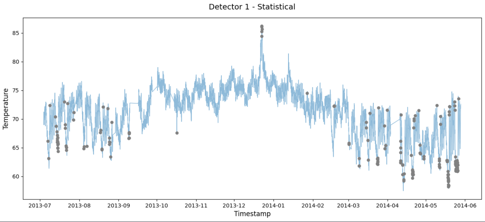
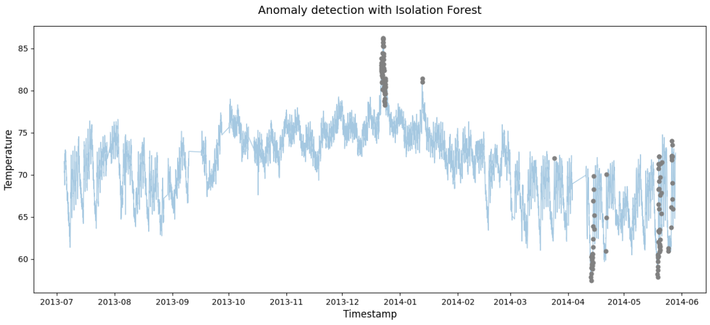
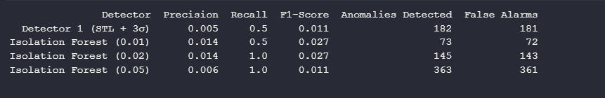
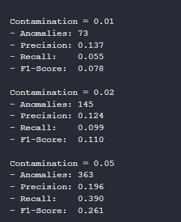
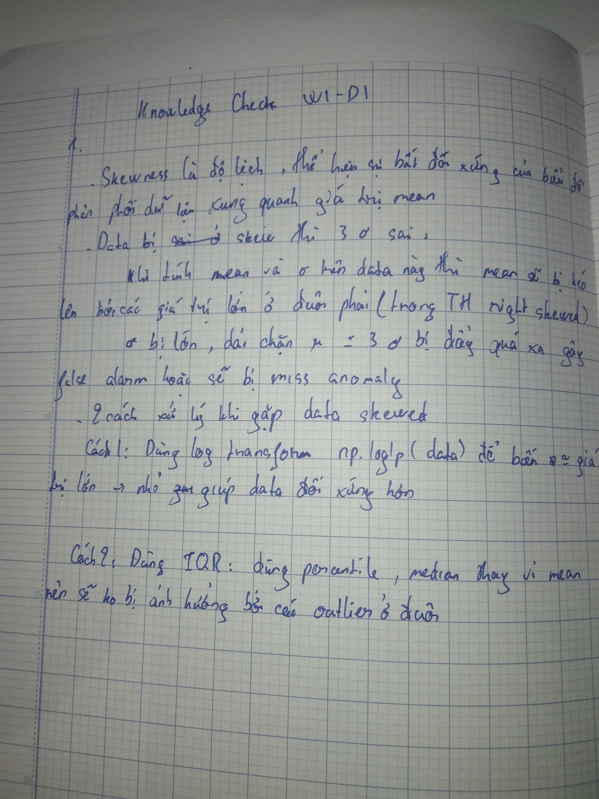
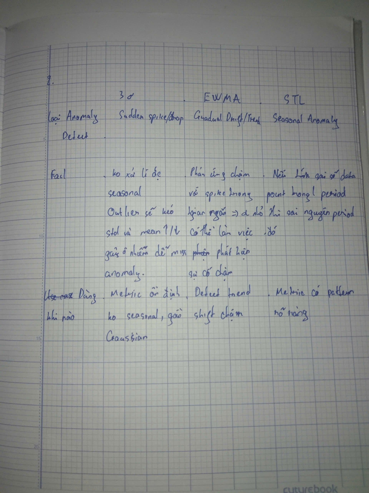

# Screenshots: plot kết quả anomaly detection (2 detector)
## Detector 1: 

## Detector 2: 

## Precision/recall compare

## Log: output khi tune contamination:

## Model Artifacts
- **Model file:** `IF_Model_Artifacts.joblib`

# Reflection:
## Data
Data ambient_temperature_system_failure.csv thuộc loại data có tính Seasonal với chu kì 24h thông qua phân tích ACF và gần Gaussian với Skewness = -0.39 nằm trong khoảng từ -0.5 đến 0.5.

## Method
Detector 1: Sử dụng STL Decomposition + 3σ vì phương pháp này hiệu quả trong việc loại bỏ biến động chu kỳ 24h, giúp cô lập thành phần dư (residuals). Áp dụng ngưỡng $3\sigma$ trên phần dư là cách tiếp cận thống kê trực quan để phát hiện các điểm sai lệch so với kỳ vọng.

Detector 2: Sử dụng Isolation Forest để xử lý dữ liệu với các features với lag, rolling mean, rate of change,... Mô hình có khả năng cô lập hiệu quả các điểm dị thường nằm ở vùng mật độ thấp

## Comparison and Trade-off
### Detector nào tốt hơn
Isolation Forest vượt trội hơn trong bài toán này nhờ khả năng học được các đặc trưng phức tạp của hệ thống, trong khi STL đôi khi bị nhiễu bởi các biến động nhỏ trong phần dư.

### Trade-off
Khi contamination thấp (0.01): Mô hình bỏ sót lỗi (Recall thấp (0.5)).

Khi contamination cao: Mô hình nhạy cảm quá mức, dẫn đến "nhiễu" cảnh báo (False Alarms cao (> 300)).

## Production Choice
Chọn IF contamination 0.02 vì nó vừa có recall cao (1) thay vì 0.01 recall thấp (0.5) và cũng không chọn 0.05 vì false alarm quá cao

# Knowledge Check

