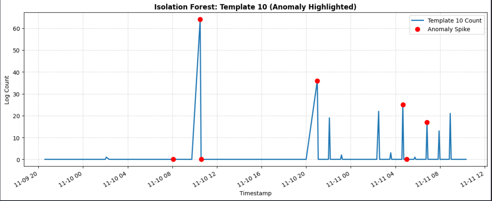
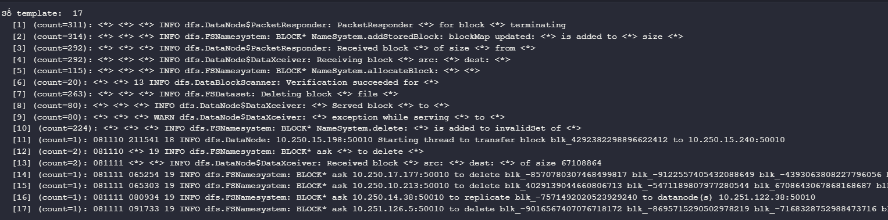
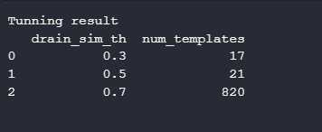
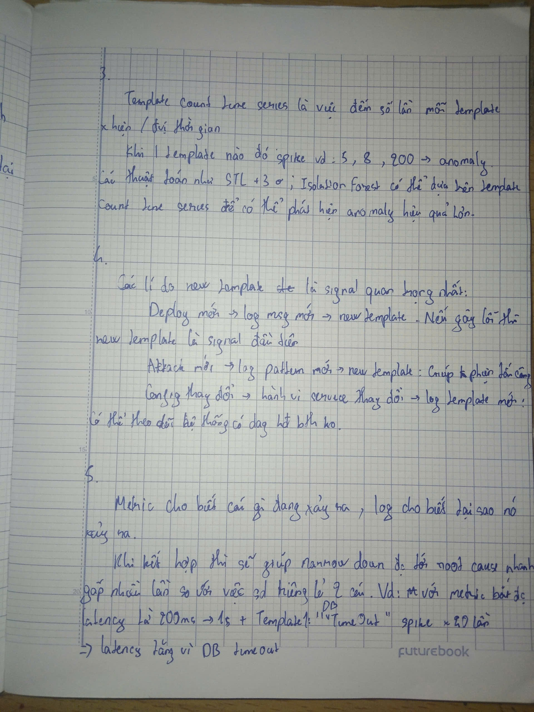

# Screenshots: plot template count time series, anomaly highlighted

# Log: output Drain3 
## Số template

## Top-10
- Top-10 Template file: `top_templates.csv`
## Tuning log (sim_th values + kết quả)

# Reflection: 
## Drain3 parse tốt không
Drain3 parse tốt với log thực tế vì nó tự động gom log theo cấu trúc, không cần regex thủ công. Tuy nhiên hiệu quả phụ thuộc vào preprocessing và tham số(drain_sim_th) như TH HDFS log thì 0.3 sẽ cho ra số template hợp lí nhất không như >300 template nếu threshold là 0.7.

## Template nào cho insight
New Template sẽ là template cho insight quan trọng nhất vì nó đại diện cho một trạng thái hệ thống hoàn toàn mới mà mô hình chưa từng được huấn luyện hoặc chưa từng ghi nhận trước đó.

## Metric vs log khác gì
Sự khác nhau cơ bản nhất là metric cho biết cái gì đang xảy ra còn log cho biết lí do tại sao nó xảy ra.

# Knowledge Check

