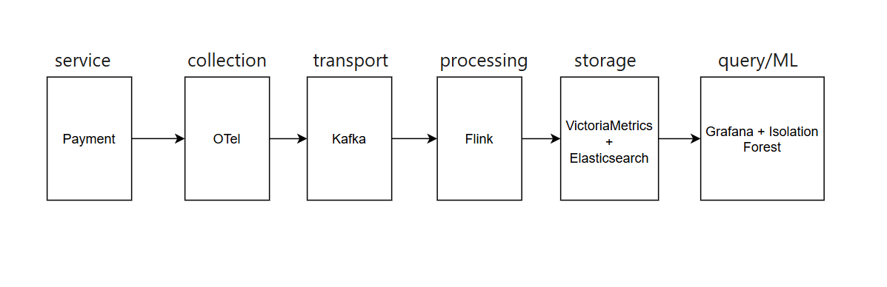

# Screenshot architecture diagram

# Bảng cost estimate (copy từ output cost_model.py) 
Build breakdown
+--------+-----------+-----------+-----------+-----------+
| Tier   | Storage   | Compute   | Network   | Total     |
+========+===========+===========+===========+===========+
| Small  | $64.50    | $150.00   | $15.00    | $229.50   |
+--------+-----------+-----------+-----------+-----------+
| Medium | $645.00   | $1500.00  | $150.00   | $2295.00  |
+--------+-----------+-----------+-----------+-----------+
| Large  | $6450.00  | $15000.00 | $1500.00  | $22950.00 |
+--------+-----------+-----------+-----------+-----------+

Buy breakdown
+--------+-----------+-------------+-----------+-------------+
| Tier   | Storage   | Compute     | Network   | Total       |
+========+===========+=============+===========+=============+
| Small  | $60.00    | $12960.00   | $30.00    | $13050.00   |
+--------+-----------+-------------+-----------+-------------+
| Medium | $600.00   | $129600.00  | $300.00   | $130500.00  |
+--------+-----------+-------------+-----------+-------------+
| Large  | $6000.00  | $1296000.00 | $3000.00  | $1305000.00 |
+--------+-----------+-------------+-----------+-------------+

Build vs Buy 
+--------+-----------+-------------+
| Tier   | Build     | buy         |
+========+===========+=============+
| Small  | $229.50   | $13050.00   |
+--------+-----------+-------------+
| Medium | $2295.00  | $130500.00  |
+--------+-----------+-------------+
| Large  | $22950.00 | $1305000.00 |
+--------+-----------+-------------+

# Tóm tắt ADR decision
Quyết định kiến trúc chính của hệ thống là sử dụng Apache Kafka làm lớp truyền tải dữ liệu giữa OpenTelemetry Collector và Apache Flink, thay vì gửi dữ liệu trực tiếp (Direct Push).

## Lý do lựa chọn:
Kafka cung cấp cơ chế buffering giúp tránh mất dữ liệu khi Flink hoặc storage gặp sự cố.
Hỗ trợ replay dữ liệu phục vụ điều tra sự cố và huấn luyện lại mô hình anomaly detection.
Giảm tác động của traffic spike nhờ khả năng xử lý backpressure.
Cho phép producer và consumer mở rộng độc lập.

## Trade-offs:
Tăng chi phí hạ tầng do cần vận hành Kafka cluster.
Tăng độ trễ truyền tải khoảng 5–20 ms so với Direct Push.
Tăng độ phức tạp vận hành (broker management, monitoring, capacity planning).

# Reflection: 
## Nếu bạn được hire làm Platform Engineer cho startup 50-service vừa raise Series A, bạn sẽ recommend build hay buy? Tại sao?

Tốt hơn nên áp dụng hybrid vừa build vừa buy, dùng tiền mua sự ổn định cho metrics, dùng kỹ thuật để tiết kiệm chi phí cho logs
Buy (SaaS): Cho Metrics & Alerting. Cần tốc độ phát triển nhanh, không tốn nhân sự vận hành.
Build (Self-host): Cho Logs (lưu trên S3/GCS). Vừa kiểm soát chi phí (Logs rất đắt trên SaaS), vừa đảm bảo bảo mật dữ liệu thanh toán.